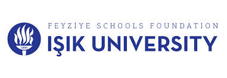

# Applied Natural Language Processing for Undergraduate

### 👤 Instructor: Mehmet Can Yavuz, PhD — [mehmetcanyavuz.com](http://mehmetcanyavuz.com)

---

## Course Overview
This hands-on programming series bridges the gap between Natural Language Processing (NLP) theory and real-world applications. Students will gain practical NLP skills through interactive coding exercises and projects, focusing on tasks like text analysis, sentiment classification, named entity recognition, and topic modeling.

---

## Aim & Audience
Designed for undergraduate students with basic programming skills (e.g., Python) and an interest in AI and language processing, this course combines theoretical foundations with practical implementation. It equips learners to build and deploy NLP models for real-world problems.

---

## Schedule
The course is structured into modules, each focusing on key NLP concepts and techniques. Below is the schedule with corresponding Jupyter notebooks and exercises:

| Week | Topics | Description | Related Folders |
|------|---------------------|-----------------|-----------------|
| **1** | Words, Dictionaries, and Distinctive Terms | Learn to identify distinctive terms using statistical tests. Plot sentiment over time using human-defined dictionaries. | `2. words/` `3. distinctive_terms/` `4. dictionaries/` |
| **2** | Classification | Gather data, engineer features, analyze feature weights, and explore hyperparameters for text classification. |`5. classification/` |
| **3** | Regression and Evaluation / Measurement / Testing | Apply linear regression with L1/L2 regularization for tasks like box office prediction. Estimate confidence intervals and perform hypothesis testing. | `6. text_regression/` `7 & 8. tests/` |
| **4** | Computational Semantics | Build and explore high-dimensional, sparse word representations using distributional hypothesis and TF-IDF scaling. Implement semantic orientation methods. | `9 & 10. embeddings/` |
| **5** | Neural Networks I – Word Embeddings & MLP | Explore MLP for text classification and document classification. | `11 & 12. neural/` |
| **6** | Neural Networks II – CNN | Explore CNN for text classification and document classification. | `13. neural/` |
| **7** | Neural Networks III – LSTM & Attention | Explore LSTM, and attention mechanisms for text classification and document classification. | `14. neural/` |
| **8** | Data Annotation | Calculate inter-annotator agreement using Cohen's kappa and Krippendorff's alpha. | `15. annotation/` |
| **9** | WordNet | Explore WordNet synsets, implement Lesk algorithm, and retrofit word vectors. | `16. wordnet/` |
| **10** | POS Tagging | Understand Penn Treebank POS tags and extract keyphrases using TF-IDF and POS filtering. | `18. pos/` |
| **11** | Named Entity Recognition (NER) | Extract social networks, perform Twitter NER with BiLSTM, and resolve toponyms for visualization. | `19. ner/` |
| **12** | Syntactic Analysis of Dependencies | Use dependency parsing to analyze actions and objects associated with characters. | `22. syntax/` |
| **13** | Coreference | Install neuralcoref and generate timelines from Wikipedia biographies. | `23. coref/` |
| **14** | Clustering | Discover themes in movie summaries using topic modeling. | `26. clustering/` |

---

## How to Use This Repo
- **Clone the Repository**: Access lecture notebooks, coding exercises, and datasets by cloning this repository.
- **Setup**: Install dependencies via `requirements.txt` (includes libraries like NLTK, spaCy, Keras, Gensim, and neuralcoref).
- **Navigation**: Exercises and notebooks are organized by module in directories (e.g., `/2.distinctive_terms/`, `/8.neural/`).
- **Datasets**: Sample datasets (e.g., NLTK corpora, Twitter data) are stored in `/data/`.
- **Contribute**: Open issues for questions or bugs, and submit pull requests for corrections or enhancements.

---

## ⚖️ License
This course is released under the [MIT License](LICENSE).  
It is adapted and customized from [Berkeley Info 256 Applied Natural Language Processing 2019](https://github.com/dbamman/anlp19) by David Bamman.

---

**Join us at Işık University to master applied NLP! 🎓📝**